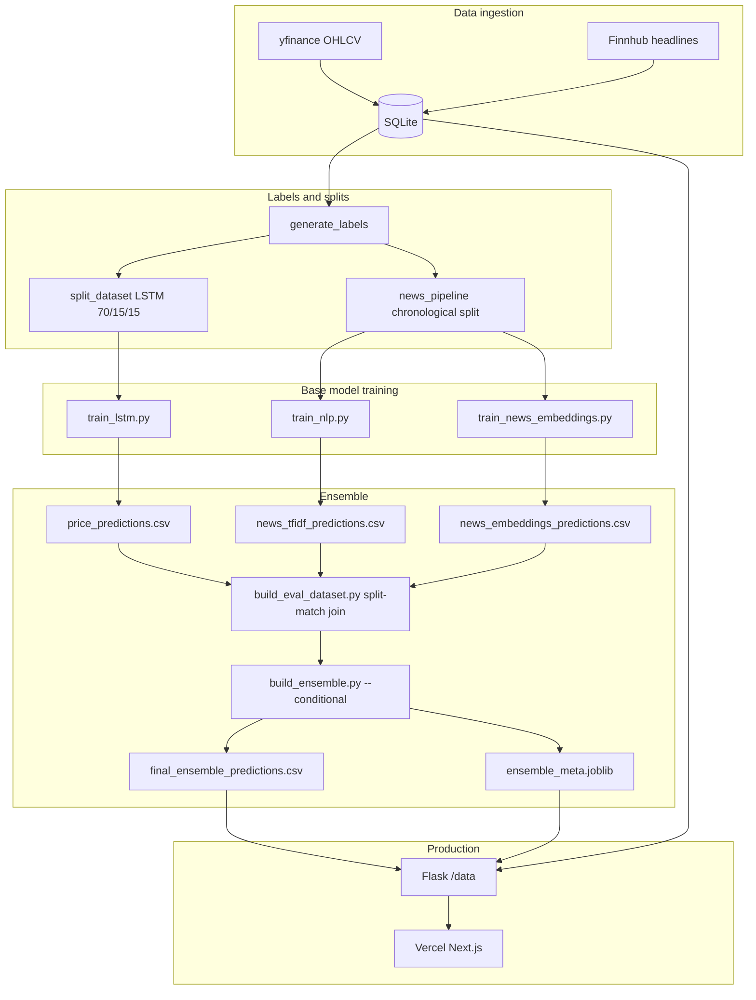
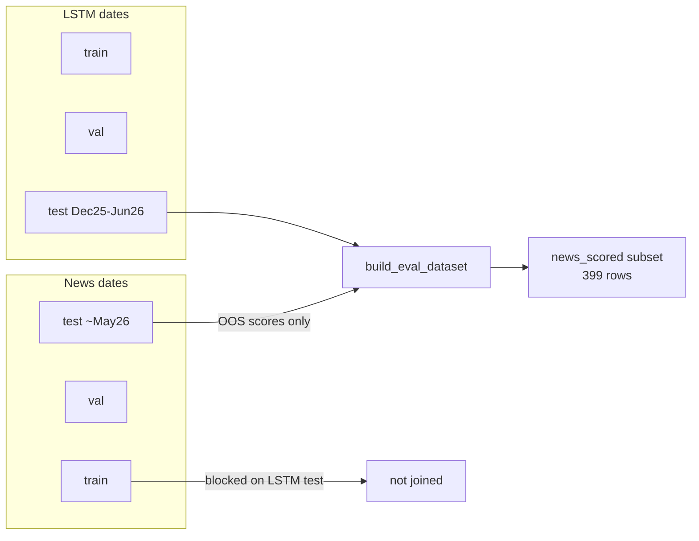

# Project overview

Architecture reference for contributors. Operational commands live in [DATA.md](DATA.md). Evaluation metrics in [RESULTS.md](RESULTS.md).

---

## System summary

Predicts **next NYSE session direction** (UP/DOWN) for 20 US tickers by combining:

| Model | Input | Output |
|-------|--------|--------|
| **LSTM** | 60-day price window + 37 features + ticker embedding + SPY/VIX regime | P(UP) |
| **TF-IDF** | Cutoff-aligned headline bigrams (4 PM ET rule) + publisher one-hot | P(UP) |
| **FinBERT embeddings** | Relevance-weighted mean-pooled `ProsusAI/finbert` headline vectors | P(UP) |
| **Ensemble** | HistGradientBoosting on 13 base outputs + context features | Final P(UP) |

**Conditional ensemble** (`build_ensemble.py --conditional`): separate meta-models for days with vs without headlines. Production uses this layout.

**Shipped stack:** Next.js UI (`web/`) + Flask JSON API (`app/server.py`). Training is CLI-only — no web-triggered retrain in production (`INFERENCE_ONLY=true`).

---

## End-to-end pipeline



---

## Evaluation and leakage prevention



- **`build_eval_dataset.py`** left-joins from LSTM rows; news probabilities apply only when `news_tfidf_split == split`.
- **`evaluate_predictions.py`** reports `news_scored` and `news_oos` subsets for honest headline-day metrics.
- Never compare against pre-June-2026 ensemble numbers that used blind news joins (~62% was leakage-inflated).

---

## Repository layout

```
app/                 Flask API + optional job queue
scripts/             CLI pipeline entry points
src/                 ML library (collection → features → models)
web/                 Next.js dashboard
tests/unit/          pytest suite
docs/                Documentation
data/                Artifacts (gitignored)
```

---

## Core modules (`src/`)

### Configuration & utilities

| Module | Role |
|--------|------|
| `config.py` | Paths, tickers, hyperparameters, 4 PM ET cutoff |
| `utils/trading_calendar.py` | NYSE sessions, market open/close |
| `ml/threshold_tuning.py` | Val threshold tuning + calibration spread guards |
| `ml/model_diagnostics.py` | Shared train/val/test metrics, per-ticker AUC |

### Features

| Module | Role |
|--------|------|
| `features/sequence_generator.py` | 60-day LSTM windows (37 features) |
| `features/technical_indicators.py` | RSI, MACD, Bollinger, VIX regime, etc. |
| `features/news_sentiment.py` | FinBERT sentiment helpers |
| `features/publisher_features.py` | Publisher one-hot |

### Models

| Module | Role |
|--------|------|
| `models/lstm_model.py` | `StockLSTM` + `LSTMTrainer` (AUC early-stop, epoch diagnostics) |
| `models/news_pipeline.py` | Shared news dataset builder for TF-IDF and embeddings |

### Inference & explanation

| Module | Role |
|--------|------|
| `ml/ensemble_explain.py` | Counterfactual driver bars; reads `features` from joblib payload |
| `ml/lstm_live_export.py` | Append LSTM rows for unlabeled dates |
| `ml/news_live_export.py` | Append news rows for live headline days |

---

## Ensemble meta-model (13 features)

Saved in `ensemble_meta.joblib` with `features` list — single source of truth for training and explanation:

```
financial_pred_proba, lstm_confidence,
news_tfidf_pred_proba, tfidf_confidence,
news_embeddings_pred_proba, emb_confidence,
has_news, n_headlines, spy_return_5d,
all_agree, news_tfidf_x_has_news, news_emb_x_has_news, lstm_x_agree
```

`/api/rationale` selects `has_news_model` or `no_news_model` when `conditional=True`.

---

## CLI scripts (`scripts/`)

| Script | Role |
|--------|------|
| `run_pipeline.py` | Full train orchestrator (`--preset`) |
| `daily_update.py` | Collect + infer + ensemble (no retrain) |
| `build_ensemble.py` | Train meta-model, write predictions CSV |
| `build_eval_dataset.py` | Split-matched join of base-model CSVs |
| `evaluate_predictions.py` | Test metrics → RESULTS.md inputs |
| `train_lstm.py` / `train_nlp.py` / `train_news_embeddings.py` | Base model training |
| `publish_deploy_bundle.py` | SSH upload to Railway `/data` |

---

## Design decisions

**SQLite** — zero-config persistence; adequate volume for this project.

**Binary classification** — next-session direction is easier to evaluate than point price forecasts. Beating 55% on a chronological **`news_scored`** split indicates real signal; current models are near 50%.

**4 PM ET cutoff** — news after close assigns to the next session; prevents leakage.

**Chronological splits** — no random shuffle; train on past, test on future.

**Conditional ensemble** — separate combiners for headline vs no-headline days; prevents no-news majority from drowning news weights.

**Calibration guards** — sigmoid prefit calibrators rejected when they collapse probability spread (common on small val sets).

**Operator-side training** — keeps cloud costs low; API serves precomputed artifacts only.

---

## Known limitations

| Area | Status |
|------|--------|
| LSTM price head | Test AUC ≈ 0.50; val AUC ~0.53 best case |
| News history depth | Finnhub free tier; OOS window only ~399 rows |
| Ensemble lift | Meta-model cannot exceed weak base models on `news_scored` |
| Walk-forward eval | Single chronological split only |

---

## Testing

```bash
pytest tests/unit -q
```

134+ unit tests covering schema, collectors, features, LSTM, news pipeline, validation, ensemble, and evaluation scripts.

---

## Further reading

- [DATA.md](DATA.md) — pipeline operations  
- [RESULTS.md](RESULTS.md) — leakage-free accuracy tables  
- [README.md](README.md) — quick start
