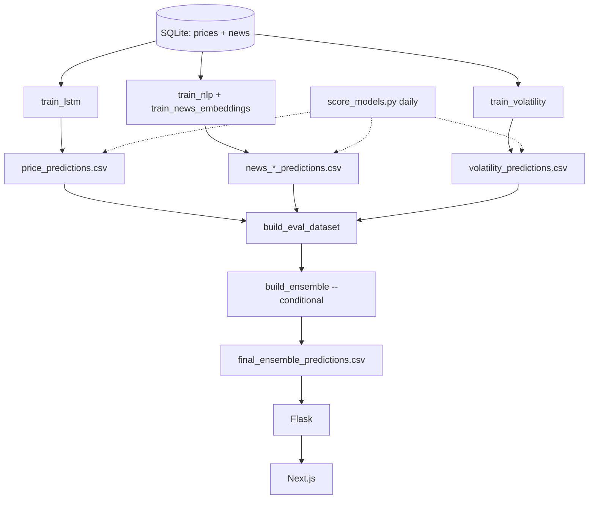

# Project overview

A detailed walkthrough of what this project does, how it is built, and why it is
built that way. For the short version see the [root README](../README.md);
for commands see [DATA.md](DATA.md) and [DEVELOPMENT.md](DEVELOPMENT.md);
for numbers see [RESULTS.md](RESULTS.md).

---

## What it does

For 20 large-cap US equities, the system forecasts two things for the next
trading session (close T → close T+1):

1. **Direction** — probability the next close is up vs down.
2. **Expected move** — the size of the next move as a ±% band (|return|).

Forecasts are produced once per session after the 4 PM ET cutoff, served by a
Flask API, and shown on a Next.js dashboard.

Daily large-cap direction is close to the efficient-market noise
floor, so the direction call is a modest signal (test AUC ≈ 0.53). The expected-move
model is more reliable (high-move AUC ≈ 0.65). The UI presents the direction call
first with the expected-move band alongside it. See [RESULTS.md](RESULTS.md).

**Universe:** AAPL, NVDA, WMT, LLY, JPM, XOM, MCD, TSLA, DAL, MAR, GS, NFLX, META,
ORCL, PLTR, GOOGL, MSFT, MU, AMD, AMZN.

---

## Data sources

| Source | Via | Stored in | Feeds |
|--------|-----|-----------|-------|
| Daily OHLCV (+ SPY, VIX) | yfinance | `prices` | LSTM, volatility |
| Company headlines | Finnhub | `news` | TF-IDF + FinBERT news models |
| Headline sentiment / relevance | FinBERT (backfilled locally) | `news.sentiment_score`, `relevance_score` | news models, embedding weights |
| Fundamentals / macro / earnings dates | yfinance + FRED | `fundamentals`, `macro`, `earnings_dates` | **gated** — see below |

Finnhub ships no sentiment, so `backfill_news_sentiment.py` scores every headline
with FinBERT after collection (wired into the pipeline and daily update).

**Gated sources:** fundamentals, macro, and earnings tables are collected and
available behind `--extra-features`, but the walk-forward harness showed no
direction lift, so they are not in the default model. They remain re-evaluable.

---

## Models

| Model | Input | Output | Test skill |
|-------|-------|--------|-----------|
| **LSTM** | 60-day window of prices, technicals, ticker embedding, SPY + VIX regime | P(up) | AUC ≈ 0.50 |
| **TF-IDF** | Cutoff-aligned headlines + publisher one-hot, logistic regression | P(up) | — |
| **FinBERT embeddings** | Mean-pooled headline vectors (ProsusAI/finbert), relevance-weighted | P(up) | — |
| **Volatility** | Realized vol, ATR, BB width, gaps, VIX, RSI, etc. (HistGradientBoosting) | `expected_move_pct` | high-move AUC ≈ 0.65 |
| **Ensemble** | 13 meta-features, conditional has_news / no_news routing (HGB + calibration) | final P(up) | AUC ≈ 0.53 |

### Why these choices

- **LSTM for price:** captures temporal structure across the 60-day window; per-ticker
  embeddings let one model serve all 20 names. Calibrated with Platt scaling and a
  tuned decision threshold; seed probabilities are averaged (not logits) to avoid the
  calibration collapse that flattened earlier versions.
- **Two news models:** TF-IDF catches literal wording patterns; FinBERT captures
  financial meaning. They disagree often, which the ensemble can exploit.
- **Conditional ensemble:** headline days and quiet days have different signal mixes,
  so a separate meta-model is fit for `has_news` vs `no_news` rows. The combiner is an
  HGB with adaptive calibration and temperature scaling.
- **Separate volatility model:** move *size* is more predictable than move *direction*,
  so it is modeled independently and surfaced as the ±% band.

---

## Pipeline



**Training** (`run_pipeline.py --preset max_v2`): labels → chronological split →
train each model → join per-model CSVs → fit conditional ensemble → evaluate.

**Daily inference** (`daily_update.py`): collect prices/news → score sentiment →
labels → `score_models.py` appends `split=live` rows for unlabeled sessions →
rebuild ensemble → evaluate. No retraining.

**Live scoring** catches up any missing `(ticker, date)` rows within a recent
window, not just dates after the last label — so a late price/news collect can't
leave a session with predictions for only some tickers.

---

## Module map

### `src/`

| Path | Responsibility |
|------|----------------|
| `config.py` | Central paths, ticker universe, hyperparameters, env overrides |
| `data_collection/` | `price_collector.py` (yfinance), `news_collector.py` (Finnhub), `base_collector.py` |
| `data_processing/` | `label_generator.py`, `dataset_split.py` (chronological), validation, standardization |
| `database/schema.py` | SQLite table definitions (`create_all_tables`) |
| `features/` | `technical_indicators.py`, `sequence_generator.py` (LSTM windows), `news_sentiment.py` (FinBERT), `publisher_features.py`, `fundamentals_features.py` (gated) |
| `models/` | `lstm_model.py` (PyTorch + calibration), `news_pipeline.py` (TF-IDF / embedding datasets) |
| `ml/` | `*_live_export.py` (inference appenders), `ensemble_explain.py` (Why tab), `threshold_tuning.py`, `model_diagnostics.py` |
| `utils/` | `collection_window.py` (incremental ranges), `trading_calendar.py` (NYSE sessions), `pipeline_config.py`, `pipeline_cleanup.py` |

### `scripts/`

| Script | Role |
|--------|------|
| `run_pipeline.py` | Full retrain orchestrator (presets) |
| `train_lstm.py` / `train_nlp.py` / `train_news_embeddings.py` / `train_volatility.py` | Per-model training |
| `collect_prices.py` / `collect_news.py` | Data collection (incremental / backfill) |
| `backfill_news_sentiment.py` | FinBERT sentiment + relevance scoring |
| `generate_labels.py` / `split_dataset.py` | Labels and chronological split |
| `build_eval_dataset.py` / `build_ensemble.py` | Join per-model CSVs, fit ensemble |
| `score_models.py` | Inference-only live scoring + outcome backfill |
| `daily_update.py` | Daily refresh (no retrain) |
| `evaluate_predictions.py` | Metrics → `evaluation_summary.txt` |
| `walk_forward_eval.py` | Purged expanding-window backtest |
| `audit_data_coverage.py` | Coverage / consistency report |
| `publish_deploy_bundle.py` / `pull_railway_data.py` | Artifact sync to/from the API host |
| `collect_fundamentals.py` / `collect_macro.py` / `collect_news_gdelt.py` | Gated extra sources |

### `web/`

Next.js 16 dashboard. Markets grid, ticker detail (hero call, headlines, Why /
Advanced tabs), and status page. Reads the Flask API via `API_BASE_URL`.
Frontend details: [../web/README.md](../web/README.md).

---

## Evaluation methodology

- **Chronological 70/15/15 split** anchored on the LSTM dataset; no shuffling.
- **No leakage:** news scores are joined only when the news model's split matches
  the row's split; the ensemble has no validation→test fallback.
- **Skill metric is AUC** for direction (accuracy is dominated by drift), MAE +
  high-move AUC for volatility.
- **Walk-forward harness** reports purged expanding-window folds as a less
  optimistic cross-check; direction targets sit near 0.49–0.50 across folds.
- News/ensemble numbers on headline days come from the **`news_scored`** subset (out-of-sample
  news window). See [RESULTS.md](RESULTS.md).

---

## Deployment

```
Local host  →  collect, train, evaluate
     │  publish_deploy_bundle.py (SSH upload)
     ▼
Railway /data volume  ←  Flask API (Dockerfile.inference, INFERENCE_ONLY=true)
     ▲
Vercel (web/)  ←  Next.js dashboard, API_BASE_URL → Railway
```

Training and raw downloads stay local; only inference artifacts (CSVs, models,
SQLite) are uploaded. Railway reads everything from the mounted `/data` volume via
path env vars (`DATABASE_PATH`, `PROCESSED_DATA_DIR`, `MODELS_DIR`). Scheduled
weekday refreshes run through `.github/workflows/daily-update.yml`.

---

## API surface

Key routes (full field tables in [DATA.md](DATA.md)):

| Route | Returns |
|-------|---------|
| `/api/ticker` | Direction call + `expected_move_pct`, `forecast_low/high`, price context |
| `/api/rationale` | Why-this-call: model inputs, Shapley drivers, `baseline_proba` |
| `/api/data-status` | Freshness, market status, pending reason |
| `/api/history` / `/api/accuracy-summary` | Resolved outcomes for charts |

---

## Design decisions worth knowing

- **Confidence ≠ P(correct):** `confidence = |p − 0.5| × 2` measures lean strength only.
- **Labels lag prices by one session:** the last labeled date is one session behind
  the last price until the next close arrives — hence the "pending" state in the UI.
- **Finnhub paging:** ~240 articles per call; collection chunks by 7 days and uses
  `--fill-gaps` to repair missing trading days.
- **sklearn version pinning:** the volatility HGB model is sensitive to scikit-learn
  minor versions across train vs serve; `requirements-inference.txt` pins a compatible
  range (see [DATA.md](DATA.md)).
