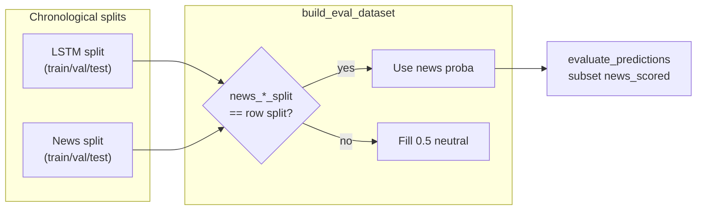

# Evaluation results

Metrics from the held-out **test split** (LSTM chronological split, n=2,220 rows, Dec 2025–Jun 2026). Generated by `scripts/evaluate_predictions.py` from `data/processed/final_ensemble_predictions.csv`.

**Configuration (June 2026 retrain):** 20 tickers, next-day horizon, FinBERT embeddings encoder, TF-IDF + publisher one-hot, conditional ensemble (`build_ensemble.py --conditional`), 13-feature meta schema (LSTM kept), 0.5% min-move filter on LSTM train, single-seed LSTM (seed 42).

**Reproduce:**

```bash
python scripts/build_eval_dataset.py
python scripts/build_ensemble.py --conditional
python scripts/evaluate_predictions.py --horizon 1
cat data/processed/evaluation_summary.txt
```

Outputs also written to `evaluation_overall.csv`, `evaluation_by_ticker.csv`, `evaluation_by_confidence.csv`.

**Last full retrain:** 2026-06-02 (local). Live site restored June 2026 (data-only republish). Improved republish **not** deployed — honest `news_scored` accuracy remains below the 55% gate.

---

## Which subset to report

| Subset | When to use |
|--------|-------------|
| **`news_scored`** | **Primary honest metric** — news models scored on their held-out test split (n=399) |
| `all` (LSTM test) | Full price window; news columns are 0.5 fill except on `news_scored` rows |
| `has_news` | Rows with headlines; still mostly neutral news fill outside `news_scored` |
| `high_conf` | Ensemble confidence ≥ 0.3 |



---

## Test set — all rows (n = 2,220)

LSTM-anchored test window. News models only have out-of-sample scores on **`news_scored`**; other rows use neutral 0.5 fill.

| Model | Accuracy | Precision (UP) | Recall (UP) | F1 (UP) | AUC |
|-------|----------|----------------|-------------|---------|-----|
| previous_day_direction | 0.515 | 0.527 | 0.531 | 0.529 | 0.514 |
| always_up | 0.514 | 0.514 | 1.000 | 0.679 | 0.500 |
| lstm_price | 0.507 | 0.516 | 0.638 | 0.570 | 0.503 |
| **ensemble** | **0.506** | 0.522 | 0.461 | 0.490 | **0.505** |
| news_embeddings | 0.490 | 0.517 | 0.109 | 0.180 | — |
| news_tfidf | 0.487 | 0.505 | 0.094 | 0.158 | — |

---

## Subset: `news_scored` (n = 399) — **report this**

Rows where `news_tfidf_split == split` (and same for embeddings). News predictions are **out-of-sample** on these dates (~May 2026 window).

| Model | Accuracy | AUC |
|-------|----------|-----|
| previous_day_direction | 0.526 | 0.525 |
| always_up | 0.526 | 0.500 |
| lstm_price | 0.511 | 0.504 |
| **ensemble** | **0.501** | **0.492** |
| news_embeddings | 0.496 | 0.487 |
| news_tfidf | 0.481 | 0.496 |

---

## Subset: high ensemble confidence (n = 1,357)

Rows where ensemble confidence ≥ 0.3 (`|P(UP) − 0.5| × 2`).

| Model | Accuracy | AUC |
|-------|----------|-----|
| always_up | 0.526 | 0.500 |
| lstm_price | 0.508 | 0.497 |
| previous_day_direction | 0.506 | 0.505 |
| **ensemble** | **0.504** | **0.509** |

---

## Key findings (June 2026)

### 1. Evaluation join fix

Earlier ensemble metrics (~62% test accuracy, ~0.66 AUC) were inflated by joining **train-split news predictions** onto LSTM test rows. `build_eval_dataset.py` now left-joins from LSTM and only uses news scores when `news_*_split` matches the row's split. Always report **`news_scored`** for honest news/ensemble comparison.

### 2. Live site restore

Production `Why this call` broke when a 12-feature conditional meta-model was published while the deployed explainer expected 13 features. Restored with schema-compatible 13-feature ensemble + data-only Railway republish. Explainer now reads `features` from `ensemble_meta.joblib` and routes conditional sub-models correctly (`app/server.py`).

### 3. LSTM — modest val signal, test at noise floor

Best config after iteration: `[32,32]` units, dropout 0.30, lr 0.0005, single seed 42, min-move 0.5%. Val AUC **0.528**, test AUC **0.503**, proba std **0.048** (non-collapsed). Per-ticker test AUC varies (NFLX 0.61, DAL 0.43). Target test AUC ≥ 0.52 not reached.

### 4. News models — calibration collapse fixed

Sigmoid prefit calibration was compressing probabilities (std ~0.01, 100% UP predictions). Added spread guard in `src/ml/threshold_tuning.py`; both news trainers skip degenerate calibration. Post-fix test proba std: TF-IDF **0.10**, embeddings **0.08**.

| Model | Val AUC | Test AUC (`news_scored`) |
|-------|---------|--------------------------|
| TF-IDF | 0.509 | 0.496 |
| FinBERT embeddings | 0.521 | 0.487 |

### 5. Ensemble below republish gate

| Metric | Target | Actual (`news_scored`) |
|--------|--------|------------------------|
| Ensemble accuracy | ≥ 55% | **50.1%** |
| Ensemble AUC | — | 0.492 |
| LSTM test AUC | ≥ 0.52 | 0.504 |
| All three models contributing | yes | yes (13-feature schema) |

Limited Finnhub news history (~6 months OOS vs multi-year LSTM window) is the main structural constraint.

---

## Limitations

| Limitation | Impact |
|------------|--------|
| Split misalignment | LSTM test spans Dec 2025–Jun 2026; honest news OOS only on ~399 rows (May 2026) |
| Finnhub free tier | ~1 year of news; LSTM train predates news coverage |
| Weak base signal | All models ≈ 50% AUC on `news_scored`; meta-model cannot combine noise into edge |
| Single test split | No walk-forward or purged CV yet |
| Next-day horizon | 3-day presets exist; UI defaults to 1-day |

---

## Where metrics appear in the UI

| Location | Source |
|----------|--------|
| `/status` | `evaluation_overall.csv`, freshness from `/api/data-status` |
| Ticker Why tab | `/api/rationale` — counterfactual drivers from `ensemble_explain.py` |
| Ticker Advanced tab | Per-model probabilities, rolling accuracy |

Regenerate after retrain: `python scripts/evaluate_predictions.py --horizon 1`
